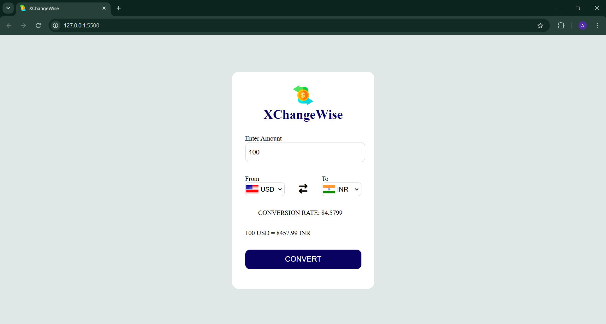

#   XChangeWise

XChangeRate is a currency converter tool that allows users to convert between different currencies using real-time exchange rates. It fetches live data through an API and provides a simple, interactive interface built with HTML, CSS, and JavaScript, ensuring a smooth user experience for currency conversion. The app is designed to be responsive and easy to use, making it an efficient solution for quick currency calculations.
## Features

1. Real-Time Currency Conversion: Fetches live exchange rates using an API to provide accurate conversion.
2. Multiple Currency Support: Allows users to convert between a wide range of global currencies.
3. Interactive User Interface: Simple and intuitive design for easy navigation and usage.
4. Responsive Design: Fully responsive layout for smooth operation across devices (desktop, tablet, mobile).
5. Automatic Conversion: Instant updates when users select currencies or input amounts.
6. Customizable Currency Selection: Users can choose from various currencies for both base and target conversions.

## Screenshot




## Run Locally

Clone the project

```bash
  git clone https://github.com/gupta03akshita/XChangeRate.git
```

Go to the project directory

```bash
 cd XChangeRate
```

Open the project in your browser

```
 Open index.html in any browser.
```

## API Reference

#### Get all items

```http
  GET /v6/{apiKey}/pair/{fromCurrency}/{toCurrency}

```

| Parameter | Type     | Description                |
| :-------- | :------- | :------------------------- |
| `api_key` | `string` | **Required**. Your API key |
| `fromCurrency` | `string` | **Required**. The currency you are converting from. |
| `toCurrency` | `string` | **Required**. The currency you are converting to. |


#### Example Request

```http
  GET /v6/YOUR_API_KEY/pair/USD/INR
```
This request will fetch the conversion rate from USD to INR.

```json
{
  "conversion_rate": 82.62,
  "from_currency": "USD",
  "to_currency": "INR"
}
```
| Field | Type     | Description                       |
| :-------- | :------- | :-------------------------------- |
| `conversion_rate`      | `float` | The conversion rate between from_currency and to_currency. |
| `from_currency`      | `string` | The currency code from which conversion is happening. |
| `to_currency`      | `string` | The currency code to which the conversion is happening. |

### Note
- Replace "YOUR_API_KEY" with your actual API key.
- fromCurrency and toCurrency are the currency codes (e.g., USD, INR).
- The conversion rate is returned in the conversion_rate field.

